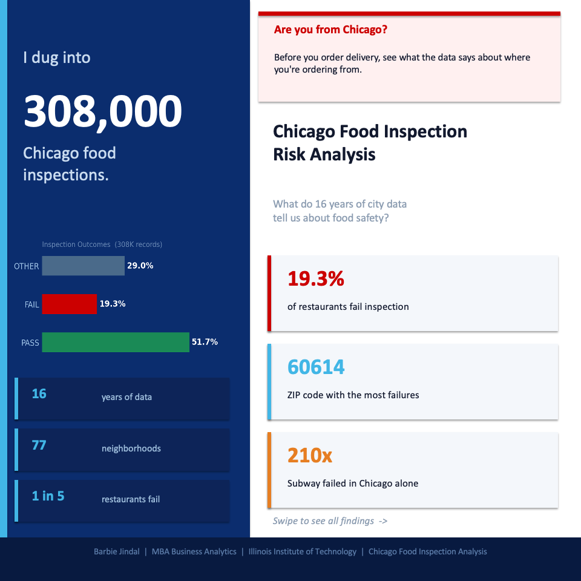
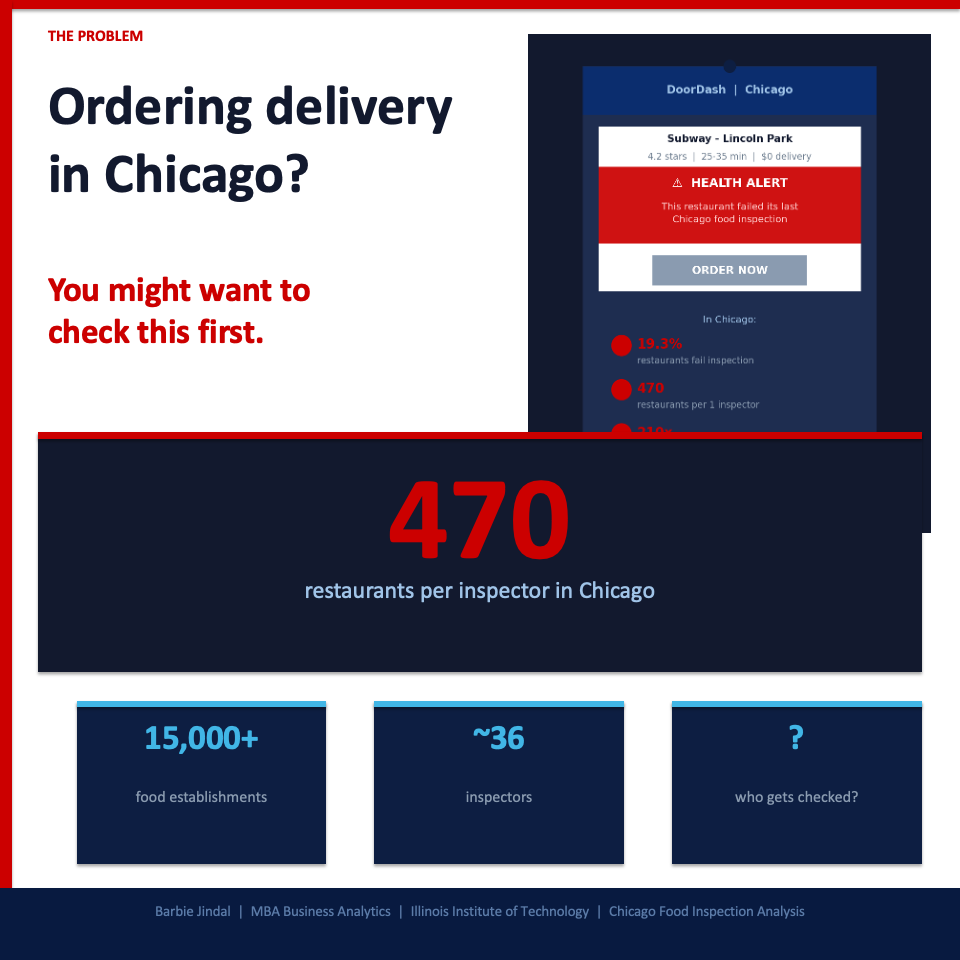
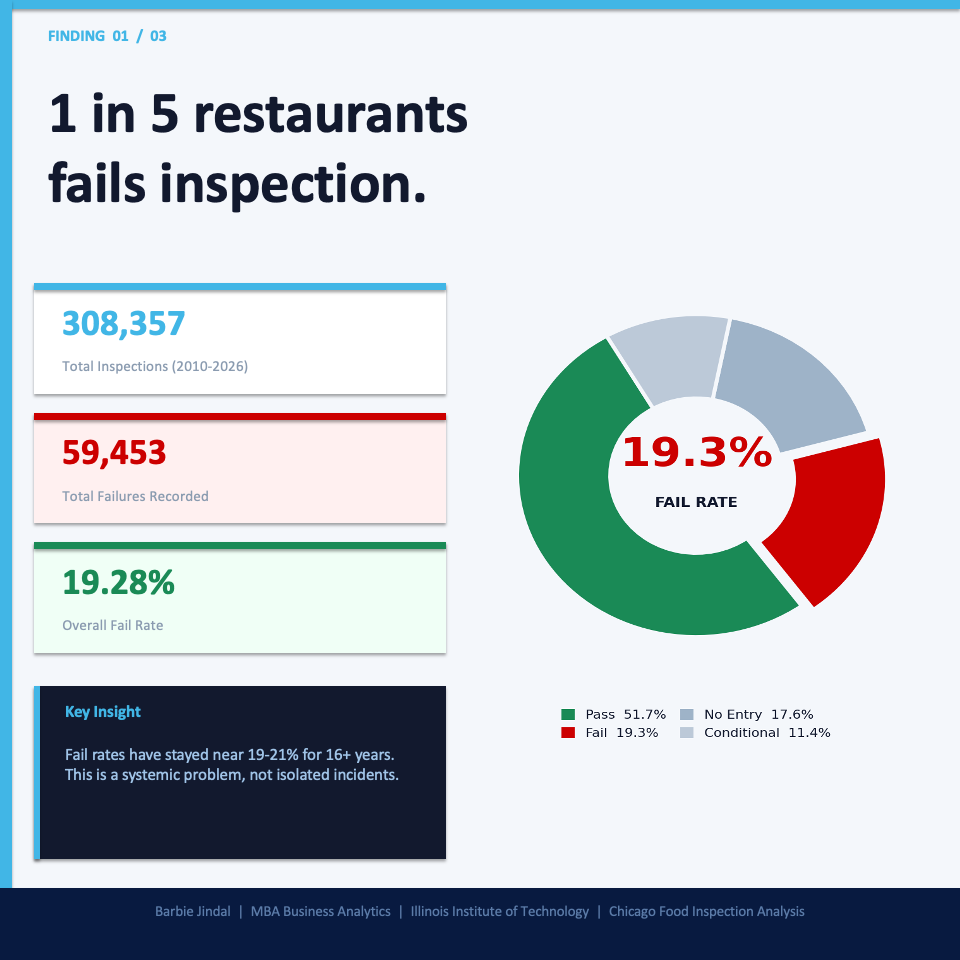
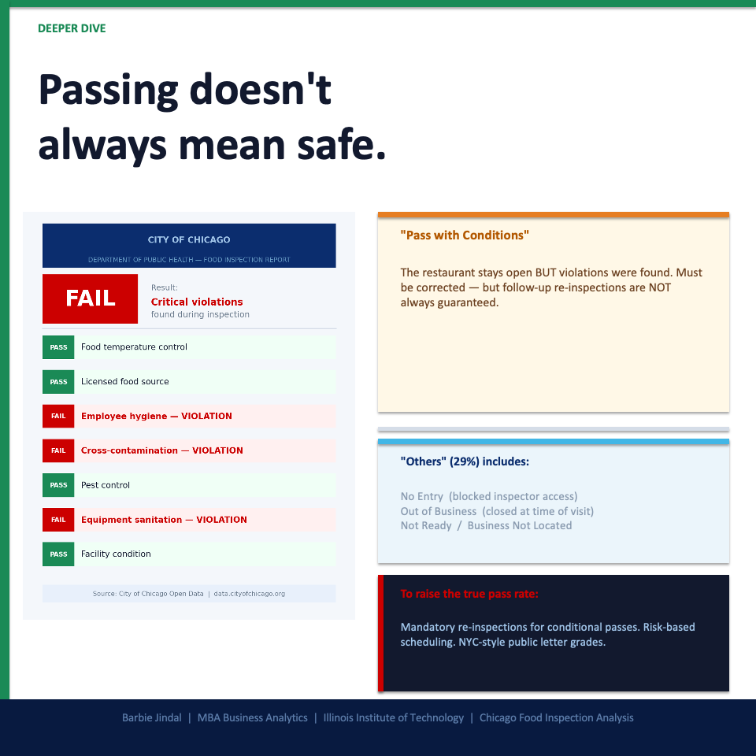
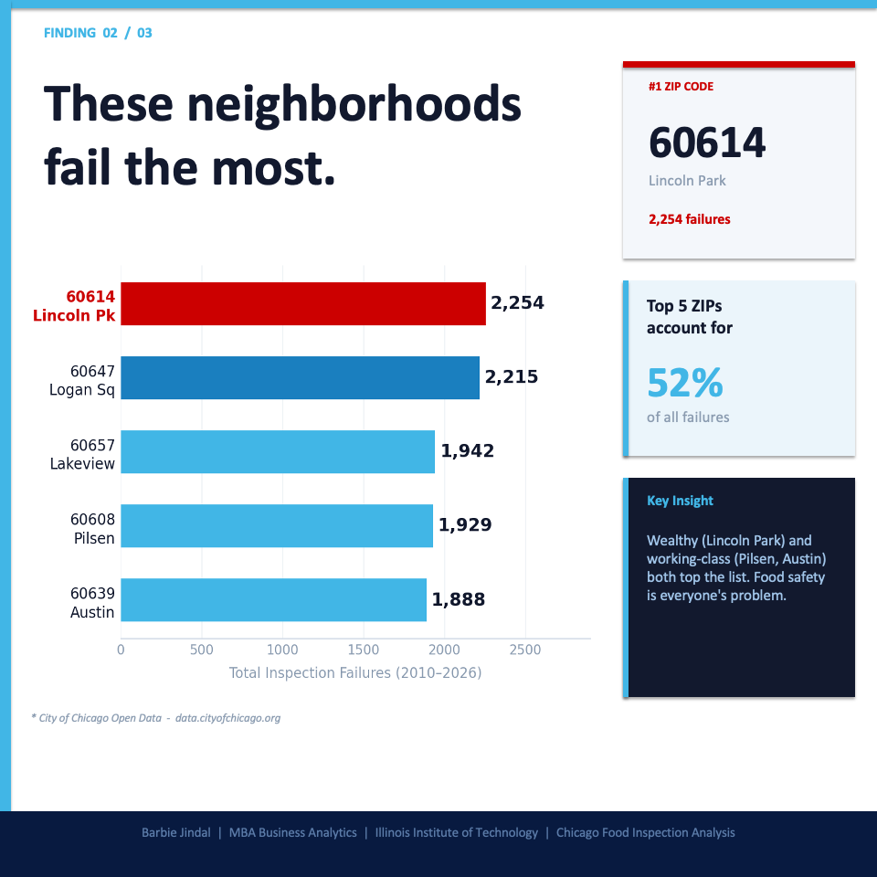
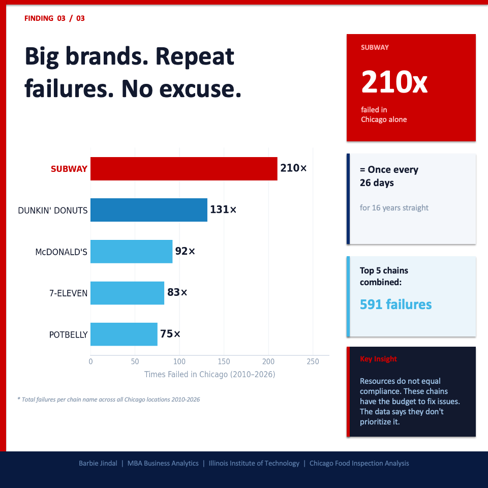

# Chicago Food Inspection Risk Analysis 
**Tools:** SQL (SQLite), DBeaver, Python, Tableau Public &nbsp;|&nbsp; **Data Source:** City of Chicago Open Data Portal &nbsp;|&nbsp; **Location:** Chicago, Illinois &nbsp;|&nbsp; **Time Period:** 2010 – 2026

## Project Overview

This project analyzes 308,357 food inspection records from the City of Chicago Open Data Portal to identify patterns in inspection failures across ZIP codes, restaurant chains, and risk categories. The objective is to understand where food safety risks are concentrated, which establishments are repeat offenders, and what systemic issues drive a persistently high failure rate across 16 years of city data.

Python was used to load the raw 308K-row CSV into a local SQLite database after DBeaver ran out of memory on direct import. All analysis was conducted in SQL using DBeaver, and findings were visualized in an interactive Tableau Public dashboard.

## Research Questions

1. How many total inspection records exist in the dataset, and what columns are available?
2. What is the overall breakdown of inspection outcomes — Pass, Fail, and Others?
3. How does inspection outcome vary by risk level (High, Medium, Low)?
4. Which ZIP codes have the highest number of inspection failures?
5. Which restaurant chains are repeat offenders with the most cumulative failures?
6. What does a "Pass" actually mean — and why is "Pass with Conditions" still a public health concern?

## Dataset Description

- **Granularity:** One row = one inspection event
- **Source:** City of Chicago Open Data Portal — Food Inspections
- **URL:** [data.cityofchicago.org/Health-Human-Services/Food-Inspections/4dn7-eekw](https://data.cityofchicago.org/Health-Human-Services/Food-Inspections/4dn7-eekw)
- **Time Period:** January 1, 2010 – April 2026
- **Total Records:** 308,357
- **License:** Public Domain

**Key Variables:**

| Column | Description |
|--------|-------------|
| `inspection_id` | Unique ID per inspection |
| `dba_name` | Restaurant name as publicly known |
| `license_num` | Business license (used to track repeat offenders) |
| `facility_type` | Type of establishment (Restaurant, School, etc.) |
| `risk` | Risk 1 (High), Risk 2 (Medium), Risk 3 (Low) |
| `zip` | ZIP code of the establishment |
| `results` | Outcome — Pass, Fail, Pass w/ Conditions, No Entry, etc. |
| `violations` | Text description of violations found during inspection |

## Key Findings

- **1 in 5 restaurants fails inspection.** Of 308,357 inspections, 59,453 resulted in Fail — an overall fail rate of 19.28%. This rate has stayed near 19–21% every single year for 16 years, indicating a systemic problem, not isolated incidents.

- **5 ZIP codes account for 52% of all failures.** ZIP 60614 (Lincoln Park) leads with 2,254 failures, followed by Logan Square, Lakeview, Pilsen, and Austin. Both high-income and working-class neighborhoods appear — food safety risk is not determined by wealth.

- **National chains are the worst repeat offenders.** Subway failed 210 times in Chicago alone between 2010 and 2026 — roughly once every 26 days for 16 straight years. Dunkin' Donuts (131x), McDonald's (92x), 7-Eleven (83x), and Potbelly (75x) follow. Top 5 combined: 591 failures. Resources do not equal compliance.

- **"Pass" does not always mean safe.** A "Pass with Conditions" allows a restaurant to stay open despite active violations, with no guaranteed follow-up re-inspection. The "Others" category (29% of all records) includes No Entry, Out of Business, Not Ready, and Business Not Located — meaning nearly 1 in 3 scheduled inspections produces no clean outcome either way.

## Skills Demonstrated

- Data acquisition from a public government open data portal (308K rows)
- Python scripting using built-in `csv` and `sqlite3` libraries to overcome tool memory limits
- SQL aggregation using `COUNT`, `SUM`, `GROUP BY`, `HAVING`, `ROUND`, `CASE WHEN`, `ORDER BY`
- Repeat offender identification by grouping on `license_num`
- Geographic failure rate analysis by ZIP code
- Risk-level segmentation using categorical filtering
- End-to-end analytics pipeline: raw CSV → SQLite → SQL analysis → Tableau dashboard

## Results Summary

| Metric | Value |
|--------|-------|
| Total inspection records | 308,357 |
| Total failures | 59,453 |
| Overall fail rate | 19.28% |
| Pass rate | 51.7% |
| "Others" category | 29.0% |
| ZIP code with most failures | 60614 — Lincoln Park (2,254) |
| Top repeat offender | Subway (210 failures in Chicago) |
| Top 5 chains combined | 591 failures |
| Restaurants per inspector | ~470 (only ~36 inspectors citywide) |

## Query Results

All SQL query outputs are exported as CSV files and viewable directly in GitHub:

| Step | Query | Result File |
|------|-------|-------------|
| 1 | Count total rows | *(see sql/queries.sql Step 1 — 308,357 confirmed)* |
| 2 | Count total columns | [View Result](data/COUNT_TOTAL_COLUMNS_SELECT_COUNT_AS_total_columns_FROM_p_202604090035.csv) |
| 3 | View all column names | [View Result](data/SEE_ALL_COLUMN_NAMES_PRAGMA_table_info_inspections__202604090023.csv) |
| 4 | Preview raw data | *(see sql/queries.sql Step 4)* |
| 5 | Pass vs Fail breakdown | [View Result](data/COUNT_PASS_VS_FAIL_How_many_restaurants_passed_vs_failed_202604090021.csv) |
| 6 | Count by risk level | [View Result](data/COUNT_BY_RISK_LEVEL_SELECT_risk_COUNT_AS_total_FROM_insp_202604090020.csv) |
| 7 | Fail rate by ZIP code | [View Result](data/FAIL_RATE_BY_ZIP_CODE_SELECT_zip_COUNT_AS_total_inspecti_202604090022.csv) |
| 8 | Repeat offenders | [View Result](data/REPEAT_OFFENDERS_SELECT_dba_name_address_zip_COUNT_AS_ti_202604090022.csv) |


## LinkedIn Carousel

The full project story is summarized in a 6-slide data carousel:








## SQL Analysis

All queries used for data exploration, aggregation, and risk analysis are in:

- [`sql/queries.sql`](sql/queries.sql)

Python data loading script:

- [`python/load_data.py`](python/load_data.py)

## How to Reproduce

1. Download the dataset from the [Chicago Open Data Portal](https://data.cityofchicago.org/Health-Human-Services/Food-Inspections/4dn7-eekw)
2. Update file paths in `python/load_data.py` and run:
```bash
   python3 python/load_data.py
```
3. Open `chicago_food.db` in DBeaver or DB Browser for SQLite
4. Run all 8 queries from `sql/queries.sql`
5. View the live Tableau dashboard: [Tableau Public](https://public.tableau.com/app/profile/barbie.jindal4061/viz/chicago_food/Dashboard1)

**Barbie Jindal** — MBA, Business Analytics, Illinois Institute of Technology

[](https://www.linkedin.com/in/barbiejindal)
[](https://public.tableau.com/app/profile/barbie.jindal4061/viz/chicago_food/Dashboard1)
